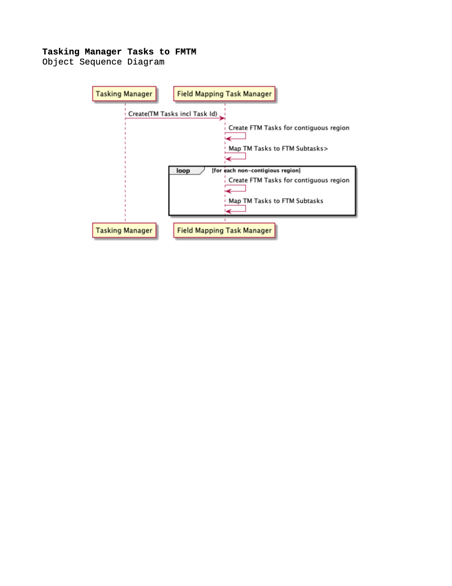

# Overarching Architecture Folder
While today HOT architecture consists of a wide range of applications and modules, the vision for the future is a more unified ecosystem. 

The key features of this architecture are:
* An integrated set of back-end modules
* A common data model based on standards and only extending as required
* Fit for purpose front-ends, built on REACT

Please refer to the [decisions](/decisions) log for details about HOT architecture decisions.

## Conceptual View
[LibreOffice Source](Overarching%20Diagrams%20-%20Conceptual.odg) 

## Information Flow
*Currently reflects completed and in-progress integrations only* 
[LibreOffice Source](Overarching%20Diagrams%20-%20Info%20Flow.odg) 

## Integration Sequence Diagrams
*Currently reflects completed and in-progress integrations only* 
[Overarching Sequence Diagrams (PDF)](Overarching%20Sequence%20Diagrams.pdf) 
[LibreOffice Source](Overarching%20Sequence%20Diagrams.odg)

|  |  |
|--|--|
| | |

## Conceptual Data Model
[LibreOffice Source](Overarching%20Data%20Model.odg) 

